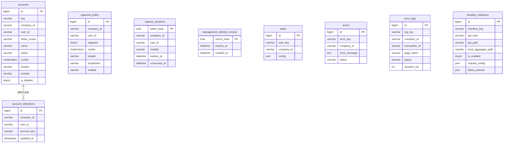
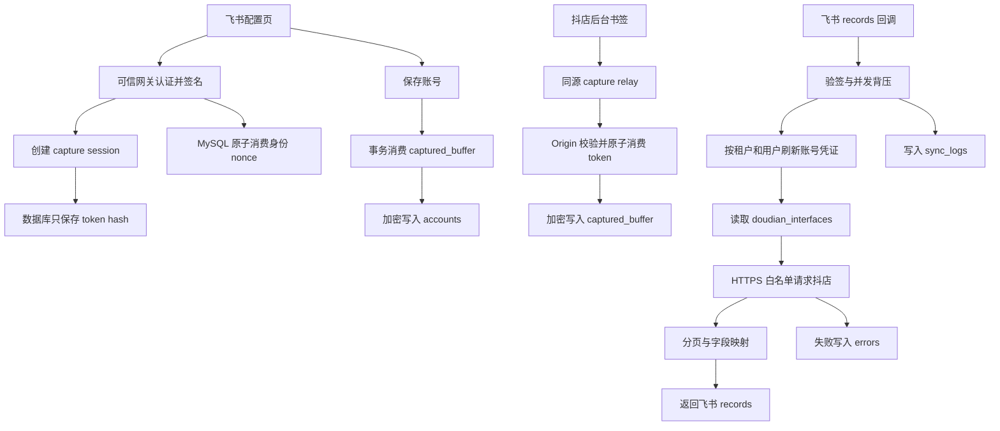

# 飞书多维表格抖店连接器数据库与功能分布

> 更新日期：2026-07-14
>
> 数据库实现以 `feishu-doudian-connector-server/database.js` 为准。

## 1. 数据库原则

- 数据库类型：MySQL 8.0 或兼容版本。
- 连接方式：`mysql2/promise` 连接池，全部连接信息来自环境变量。
- 租户隔离：核心业务表使用 `company_id`，个人账号和捕获数据同时使用 `user_id`。
- 凭证存储：账号和捕获缓冲中的 Cookie 使用 AES-256-GCM 加密，数据库不保存捕获 token 明文。
- 迁移方式：启动时获取 MySQL advisory lock，执行兼容的增量建表/扩列；发现不兼容旧表时拒绝启动，不自动删表。
- 管理后台不得直接读取 Cookie。跨系统访问必须经过带认证、审计和脱敏的 API。

## 2. 核心表

### 2.1 `accounts`

保存企业内的抖店账号。`company_id + key` 唯一；`user_id` 是所有者；`share_scope` 为 `private` 或 `company`；`cookie` 为加密凭证；删除使用 `is_deleted`、`deleted_at`、`deleted_by` 逻辑删除。

### 2.2 `account_selections`

保存每个企业用户当前选择的账号，唯一键为 `company_id + user_id`。它替代旧版全局 `accounts.is_active` 语义，避免多个用户互相覆盖共享账号选择。

### 2.3 `captured_buffer`

按 `company_id + user_id` 隔离的临时 Cookie 缓冲。前端轮询只能看到捕获状态和店铺信息，不会收到 Cookie；账号保存时由后端事务原子消费凭证。

### 2.4 `capture_sessions`

保存一次性捕获会话。主键 `token_hash` 是原始 token 的 SHA-256；`expires_at` 控制短效有效期；`consumed_at` 防止重放。

### 2.5 `management_identity_nonces`

保存可信管理网关签名的防重放状态。主键是 nonce 的 SHA-256，不保存原始 nonce；过期时间按“签名时间戳 + 最大有效窗口”计算，MySQL 唯一键确保多个 Node 实例只能有一个成功消费同一 nonce。

### 2.6 `tasks`

按企业保存飞书同步配置。写入前会移除 `accountInfo.cookie` 和顶层 `cookie`，任务 JSON 只保留账号 key、模块、字段映射和业务参数。

### 2.7 `errors`

保存同步异常归档，按 `company_id + error_key` 唯一。用于凭证失效、上游 HTTP 错误、非 JSON、超时等问题的追踪。

### 2.8 `sync_logs`

记录每次飞书 `records` 分页请求。日志 key 由事务和页 token 稳定生成，包含状态、记录数、下一页、耗时和错误信息。

### 2.9 `doudian_interfaces`

数据库驱动的抖店接口目录。`api_host` 和 `api_path` 组合真实请求地址；`request_config` 描述方法、分页、列表路径、总数路径和 Headers；`fields_schema` 同时驱动前端字段选择、`table_meta` 和 records 映射。

## 3. 主要数据流

## 4. 权限边界

- 私有账号只允许所有者读取和修改。
- 企业共享账号可被企业用户选择，但非所有者不能修改凭证或删除账号。
- 管理 API 只接受通过 HMAC 验证后的网关身份；普通 Body、Query 和客户端身份 Header 会被忽略。
- `company_id`、`user_id` 仍是数据分区字段，可信度来自网关先完成用户认证并签名，字段本身不是凭证。
- 后端端口必须限制为仅可信网关或内网可达，网关必须剥离客户端传入的全部 `X-Connector-*` Header。
- 禁止管理后台绕过服务直接读取 `accounts.cookie` 或 `captured_buffer.cookie`。

## 5. 备份与迁移

1. 每次发布前备份 MySQL，并验证恢复流程。
2. 发布时先停止旧版本写入，再启动一个新实例执行迁移。
3. `CREDENTIAL_ENCRYPTION_KEY` 必须持久保存并进入密钥管理系统。
4. 不兼容 Schema 会使服务拒绝启动。不要通过删表解决，应基于备份编写显式迁移 SQL。
5. 数据库增量结构和完整上线流程见 [生产化整改记录](./生产化整改记录.md)。
